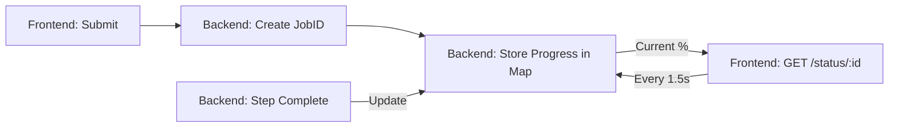

# 💻 SPE Executive Summary Generator - Technical Design
## System Architecture & Implementation Report

---

### 🚀 1. System Overview
The **SPE Automation System** is an Enterprise-grade AI application built to solve the "Unstructured Data to Structured Review" challenge. It leverages a modern asynchronous processing pipeline to transform raw presentations into high-fidelity corporate documents.

---

### 🏗️ 2. Technical Stack & Rationale

| Layer | Technology | Rationale |
| :--- | :--- | :--- |
| **Frontend** | **React 19 (Vite)** | High-performance SPA with optimized build times and HMR. |
| **Styling** | **Tailwind CSS v4 + Shadcn** | Atomic CSS architecture with premium, accessible UI components. |
| **Backend** | **Node.js (Express)** | Asynchronous I/O handling specialized for heavy document tasks. |
| **AI Engine** | **OpenAI GPT-4o-mini** | Specialized "Mini" model for low-latency, high-accuracy numeric extraction. |
| **Conversion** | **ConvertAPI** | Preserves spatial relationship and slide order during PPT-to-PDF. |
| **Document** | **`docx` JS Lib** | Programmatic control over Word styles, tables, and branding. |

---

### 🔄 3. Core Processing Pipeline (The 6-Step Pulse)

1.  **Ingestion**: Multer handles multipart file uploads. A **v4 UUID** is assigned to track the session.
2.  **Conversion**: PPTX files are converted to searchable PDFs to fulfill OpenAI Assistant requirements.
3.  **Prompt Engineering**: 
    *   **System Prompt**: Enforces "Numeric Discipline" (No inferred numbers, verbatim copying only).
    *   **User Prompt**: Directs comparison logic and forces a structured JSON output.
4.  **JSON Transformation**: Backend receiving a structured object containing Narrative and KPI Table data.
5.  **DOCX Rendering**: The `docx` library builds a stylized document using **Zuari Brand Identity** (Arial, Dark Blue `#1F4E78`).
6.  **SMTP Finalization**: Final report is dispatched to configured leadership emails via **Nodemailer**.

---

### 📉 4. Progress Tracking Engine (Polling)
To prevent timeout issues and improve UX, we implemented a real-time state-tracking microservice:

---

### 🛡️ 5. Security Architecture & Risk Mitigation

| Risk | Mitigation Strategy | Implementation |
| :--- | :--- | :--- |
| **Data Exposure** | Isolated Static Routing | The server ONLY exposes `/generatedSummary`. `/uploads` is blocked. |
| **ID Guessing** | UUID Obfuscation | 128-bit UUIDs prevent brute-force document discovery. |
| **CORS Attacks** | Whitelisted Domains | Production traffic is restricted to trusted corporate domains. |
| **Calculation Bias**| Verbatim Enforcement | AI is prohibited from re-computing deltas; it only reports slide values. |

---

### 📸 6. Implementation Evidence
*These sections are reserved for evidence-based review during the IT presentation.*

#### 6.1 Backend API Endpoint Map
> **[INSERT SCREENSHOT HERE: Express route log Showing /status and /executive-summary]**
> *Description: Clean, RESTful API design with separation of concerns.*

#### 6.2 AI Prompt Discipline
> **[INSERT SCREENSHOT HERE: Code snippet of SYSTEM_PROMPT rules]**
> *Description: The core "Logic Guard" that prevents AI hallucinations.*

#### 6.3 Final DOCX Structure
> **[INSERT SCREENSHOT HERE: The generated Word document]**
> *Description: High-fidelity output matching brand guidelines.*

---
**Prepared by Vivek Kumar | Senior Development Resource**
*Confidential: Zuari Industries IT Dept*
